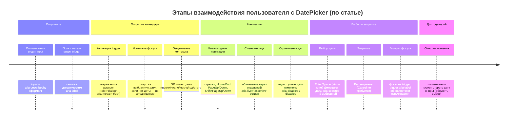

# Требования к DatePicker по статье на Хабре

## Исполнительное резюме

Статья описывает разработку **React/TypeScript DatePicker**, который целевым образом должен соответствовать **WCAG 2.1/2.2 Level AA** и ориентироваться на паттерн **WAI-ARIA APG “Date Picker Dialog”**. citeturn1view0turn4view1turn4view5 Ключевые требования в статье концентрируются вокруг: (1) понятной ARIA-структуры (input + trigger + dialog + grid), (2) полной клавиатурной навигации, (3) корректного управления фокусом (focus trap, начальный фокус, возврат фокуса), (4) корректной работы со скринридерами (динамические aria-label, корректные `aria-live`-объявления смены месяца, `aria-selected`/`aria-disabled`), (5) визуальной доступности (контраст ≥ 4.5:1, видимый фокус), (6) ограничения зависимостей (без внешних зависимостей кроме React; расчёты — нативный Date, форматирование — Intl). citeturn4view1turn4view4turn4view5turn3view1

Отдельно статья фиксирует выявленные в “сырой” версии проблемы и решения, которые фактически уточняют/скорректируют требования: при открытии диалога фокус должен вставать на выбранную дату (или на сегодняшнюю при отсутствии выбора) и скринридер должен зачитывать контекст; `aria-live="polite"` на заголовке месяца признан неудобным и заменён на скрытый `aria-live="assertive"` регион; при выборе даты фокус возвращается на кнопку-триггер и обновлённый `aria-label` должен быть озвучен; при установленной дате вне диапазона min/max компонент должен показывать месяц установленной даты с недоступными днями (а не перескакивать на “последний допустимый”); также добавлена возможность “обнулить” выбор (стереть дату в инпуте). citeturn3view1turn2view0turn2view2turn2view4turn3view3

Есть явные ограничения функциональности концепта: **нельзя листать годы сразу** и **нельзя выбирать интервал (range)** — доступен только выбор одной даты. citeturn3view5

Многие элементы, требуемые пользователем для PRD, **в статье не определены**: точные форматы ввода/вывода даты (строка, маска, ISO и т. п.), правила парсинга ручного ввода, часовой пояс/время, текстовые ошибки и сообщения в UI (кроме скринридер-объявлений), поведение на мобильных, подробности локализации (первый день недели, локаль календаря/подписей), контракты API (типы `value/onChange`, controlled/uncontrolled), нефункциональные метрики (кроме контраста) и продуктовые метрики. citeturn4view1turn4view5turn3view5

## Источник и границы анализа

Первичный источник — публикация на платформе entity["organization","Хабр","russian tech media"]: «Создаем WCAG-доступный DatePicker на React: как Claude пишет основу, а мы доводим до ума». citeturn1view0  
Автор материала указан как entity["people","Илья Новиков","tech director, codesrc"] (технический директор компании entity["organization","Исходный Код","software dev company, ru"]). citeturn3view6

Требования извлекались строго из:
- списка “Требования” (промт к Claude) — как явные требования, сформулированные в статье; citeturn4view1
- чек-листа “Наш чек-лист” — как уточнения/обоснования требований; citeturn4view4turn4view5
- секций с “проблемами” и “как починили” — как выявленные дефекты, которые автор квалифицирует как недопустимые и исправляет (то есть превращает в уточнённые требования к корректному поведению). citeturn2view0turn3view1turn3view3

Всё, чего **нет** в явных формулировках статьи, помечено как **«не указано»** в требованиях/вопросах.

## Каталог требований и ограничений

Таблица ниже фиксирует явные и вытекающие (из описанных проблем/решений) требования, ограничения и тестируемые ожидания.

| ID            | Характер                                | Точная цитата (оригинал)                                                                                                   | Краткая формулировка требования                                                                                                                                                   | Категория                          | Приоритет (обоснование)                                                                                              | Варианты реализации (только упомянутые)                                                                                                     | Место в статье (ссылка через фрагмент/раздел)                                                      |
| ------------- | --------------------------------------- | -------------------------------------------------------------------------------------------------------------------------- | --------------------------------------------------------------------------------------------------------------------------------------------------------------------------------- | ---------------------------------- | -------------------------------------------------------------------------------------------------------------------- | ------------------------------------------------------------------------------------------------------------------------------------------- | -------------------------------------------------------------------------------------------------- |
| R-ACC-01      | Явное                                   | «WCAG 2.1/2.2 Level AA» citeturn4view1                                                                                  | Компонент должен соответствовать WCAG 2.1/2.2 Level AA.                                                                                                                           | Доступность/комплаенс              | **Высокий** — это прямое требование и заявленная “планка” доступности. citeturn4view1turn4view0                  | Не указано.                                                                                                                                 | Раздел с промтом: список «Требования», п.1. citeturn4view1                                      |
| R-REF-01      | Явное                                   | «следуя строгому паттерну WAI-ARIA APG “Date Picker Dialog”» citeturn1view0                                             | Поведение и структура должны следовать паттерну WAI-ARIA APG “Date Picker Dialog”.                                                                                                | Архитектура UX/A11y                | **Высокий** — заявлен как главный ориентир. citeturn4view5                                                        | Вариант “строго следовать” vs “осознанно отступить после тестирования” — допущение отступлений зафиксировано. citeturn2view0             | Введение + чек-лист: «Наш главный ориентир…». citeturn1view0turn4view5                         |
| R-TECH-01     | Явное                                   | «…с использованием React и Typescript» citeturn4view0                                                                   | Реализация компонента должна быть на React и TypeScript.                                                                                                                          | Технологии/интеграция              | **Средний** — это архитектурное ограничение статьи/проекта. citeturn1view0                                        | Не указано.                                                                                                                                 | Введение. citeturn4view0                                                                        |
| R-STRUCT-01   | Явное                                   | «Структура: input + aria-describedby для формата» citeturn4view1                                                        | Должен быть input и связанное описание формата через `aria-describedby`.                                                                                                          | Разметка/доступность               | **Высокий** — прямо задано как часть ARIA-структуры и ориентации на скринридеры. citeturn4view4                   | Не указано (видимое/невидимое описание формата — не указано).                                                                               | Промт: «Требования», п.2 (первый пункт). citeturn4view1                                         |
| R-FMT-01      | Явное (частичное)                       | «aria-describedby для формата» citeturn4view1                                                                           | Формат даты должен быть явно обозначен пользователю через механизм, доступный скринридеру (через `aria-describedby`).                                                             | Форматы/доступность                | **Средний** — требование обозначить формат есть, но сам формат не задан.                                             | Не указано (конкретные форматы/маски/локальные шаблоны — не указано).                                                                       | Промт: «…для формата». citeturn4view1                                                           |
| R-STRUCT-02   | Явное                                   | «кнопка-триггер с динамическим aria-label» citeturn4view1                                                               | Должна быть кнопка-триггер открытия календаря с динамическим `aria-label`.                                                                                                        | ARIA/скринридеры                   | **Высокий** — ключ к объявлению выбранной даты и состояния. citeturn4view4turn3view1                             | Не указано.                                                                                                                                 | Промт: «Требования», п.2 (подпункт). citeturn4view1                                             |
| R-STRUCT-03   | Явное                                   | «popover (role="dialog", aria-modal="true")» citeturn4view1                                                             | Поповер календаря должен быть диалогом: `role="dialog"`, `aria-modal="true"`.                                                                                                     | ARIA/структура                     | **Высокий** — необходимо для корректной модальности и навигации скринридером. citeturn4view4                      | Не указано.                                                                                                                                 | Промт: «Требования», п.2 (подпункт). citeturn4view1                                             |
| R-STRUCT-04   | Явное                                   | «calendar grid (table role="grid")» citeturn4view1                                                                      | Календарь должен быть представлен как grid: `<table role="grid">`.                                                                                                                | ARIA/структура                     | **Высокий** — часть “четкой ARIA-структуры”. citeturn4view4                                                       | Не указано.                                                                                                                                 | Промт: «Требования», п.2 (подпункт). citeturn4view1                                             |
| R-GRID-01     | Явное (первично) + Уточнение (в статье) | «Roving tabindex на <td role="gridcell"> - без вложенных <button>» citeturn4view1                                       | Должна быть реализована roving tabindex-навигация по ячейкам grid. Первичная формулировка — на `td[role="gridcell"]` без вложенных `button`.                                      | Клавиатура/фокус                   | **Высокий** — часть полнофункциональной клавиатурной навигации. citeturn4view4                                    | Автор фиксирует альтернативу (см. R-GRID-02): вместо интерактивного `<td>` — `<button>` внутри `<td>`. citeturn4view6                    | Промт: «Требования», п.3. citeturn4view1                                                        |
| R-GRID-02     | Вытекает (осознанное отступление)       | «на практике <button> внутри <td> работает надежнее» citeturn4view6                                                     | Реализация интерактивности ячейки должна быть надёжной в реальных связках браузер+скринридер; автор считает более надёжным `<button>` внутри `<td>`.                              | Разметка/совместимость SR          | **Высокий** — мотивировано реальными тестами VoiceOver/NVDA и риском непредсказуемости. citeturn4view6turn4view5 | Вариант 1 (APG буквально): интерактивный `<td>` с обработчиками. Вариант 2 (выбран): `<button>` внутри `<td>`. citeturn4view6turn4view5 | Раздел «…почему мы отступили от APG». citeturn4view5turn4view6                                 |
| R-ARIA-01     | Явное (первично) + Уточнение (в статье) | «aria-live="polite" на заголовке месяца» citeturn4view1                                                                 | Должны быть объявления смены месяца через `aria-live` (первично задано как `polite` на заголовке).                                                                                | Скринридеры/оповещения             | **Высокий** — напрямую влияет на ориентирование пользователя. citeturn2view2                                      | Варианты упомянуты: `polite` (первично) vs скрытый `aria-live="assertive"` регион (итог). citeturn3view1                                 | Промт: п.4 + раздел «Проблема 2…»/«Исправление aria-live». citeturn4view1turn2view2turn3view1 |
| R-ARIA-02     | Вытекает (исправление)                  | «Перенесли объявления о смене месяца… aria-live="assertive" регион» citeturn3view1                                      | Объявления смены месяца должны быть реализованы так, чтобы не “накапливаться в очереди”; автор переносит их в скрытый `aria-live="assertive"` регион.                             | Скринридеры/оповещения             | **Высокий** — автор фиксирует неудобство очереди при `polite`. citeturn2view2                                     | Упомянутые варианты: `polite` на заголовке vs отдельный скрытый `assertive`-регион. citeturn2view2turn3view1                            | Разделы «Проблема 2…» и «Исправление aria-live». citeturn2view2turn3view1                      |
| R-ARIA-03     | Явное                                   | «aria-selected только на выбранной дате» citeturn4view1                                                                 | Атрибут `aria-selected` должен быть только у выбранной даты.                                                                                                                      | ARIA/состояния                     | **Высокий** — прямо задано как требование.                                                                           | Не указано.                                                                                                                                 | Промт: п.5. citeturn4view1                                                                      |
| R-ARIA-04     | Явное                                   | «aria-disabled="true" на недоступных датах» citeturn4view1                                                              | Недоступные даты должны быть помечены как недоступные через `aria-disabled="true"`.                                                                                               | ARIA/состояния                     | **Высокий** — прямо задано; обеспечит информирование скринридера о недоступности. citeturn4view4                  | Автор также обсуждает вариант “нативный disabled на `<button>`” (см. R-GRID-03). citeturn4view6                                          | Промт: п.6 + чек-лист. citeturn4view1turn4view4                                                |
| R-GRID-03     | Вытекает (структурное уточнение)        | «На <button> можно использовать нативный disabled…» citeturn4view6                                                      | Для недоступных дат предпочтительно использовать нативный `disabled` на `<button>` (если выбран вариант с `<button>`).                                                            | HTML-семантика/доступность         | **Средний** — это обоснование “надежнее”, но в виде решения. citeturn4view6                                       | Упомянуты варианты: `disabled` на `<button>` vs `aria-disabled="true"` + ручная логика на `<td>`. citeturn4view6                         | Раздел «…почему мы отступили…», пункт про `disabled`. citeturn4view6                            |
| R-KBD-01      | Явное                                   | «Полная keyboard navigation: стрелки, Home/End, PageUp/PageDown, Shift+PageUp/Down, Enter/Space, Escape» citeturn4view1 | Должна быть полная клавиатурная навигация и управление указанными клавишами.                                                                                                      | Клавиатура                         | **Высокий** — автор прямо пишет, что без этого пользователь без мыши “потеряется”. citeturn4view4                 | Не указано.                                                                                                                                 | Промт: п.7 + чек-лист. citeturn4view1turn4view4                                                |
| R-FOCUS-01    | Явное                                   | «Focus trap внутри dialog» citeturn4view1                                                                               | Внутри диалога должен быть focus trap (фокус не уходит за пределы модального календаря).                                                                                          | Фокус/модальность                  | **Высокий** — прямо указан как обязательный элемент доступности. citeturn4view4                                   | Не указано.                                                                                                                                 | Промт: п.8 + чек-лист. citeturn4view1turn4view4                                                |
| R-FOCUS-02    | Явное                                   | «При закрытии - фокус на триггер, aria-label обновляется» citeturn4view1                                                | При закрытии календаря фокус должен возвращаться на кнопку-триггер; `aria-label` должен обновляться.                                                                              | Фокус/скринридеры                  | **Высокий** — это “корректное поведение по APG” и влияет на объявление выбранной даты. citeturn3view1             | Не указано.                                                                                                                                 | Промт: п.9 + раздел про возврат фокуса. citeturn4view1turn3view1                               |
| R-FOCUS-03    | Вытекает (исправление)                  | «при открытии диалога фокус сразу вставал на выбранную дату, а если даты нет - на сегодняшнюю» citeturn3view1           | При открытии календаря фокус должен попадать на выбранную дату; если выбор отсутствует — на сегодняшнюю дату.                                                                     | Фокус/UX/A11y                      | **Высокий** — отсутствие этого автор называет “полной дезориентацией”. citeturn2view1                             | Не указано.                                                                                                                                 | Раздел «Проблема 1…» + «Фокус при открытии…». citeturn2view1turn3view1                         |
| R-SR-01       | Вытекает (исправление)                  | «Скринридер… зачитывает полный контекст: день недели, число, месяц, год, статус» citeturn3view1                         | При фокусе на дате скринридер должен получать полный контекст (weekday/day/month/year/status).                                                                                    | Скринридеры/UX                     | **Высокий** — это описанная целевая “правильная” озвучка.                                                            | Не указано.                                                                                                                                 | Раздел «Фокус при открытии…». citeturn3view1                                                    |
| R-API-01      | Явное                                   | «Props: value, onChange, minDate?, maxDate?, disabledDates?, locale?» citeturn4view1                                    | Компонент должен предоставлять указанные props: `value`, `onChange`, `minDate?`, `maxDate?`, `disabledDates?`, `locale?`.                                                         | API/интеграция                     | **Высокий** — это прямой контракт интеграции; без него компонент не встраивается.                                    | Не указано (типы `value/onChange`, структура `disabledDates` — не указано).                                                                 | Промт: п.10. citeturn4view1                                                                     |
| R-VAL-01      | Вытекает (дефект → требование)          | «Если начальная дата задана вне диапазона minDate/maxDate… Дезориентирует.» citeturn2view0                              | Если `value` (начальная дата) задана вне `minDate/maxDate`, компонент не должен показывать “последний допустимый месяц”; должен корректно отображать контекст установленной даты. | Валидация/UX                       | **Высокий** — прямо указано как дезориентирующее поведение.                                                          | Не указано.                                                                                                                                 | Раздел «Функциональные проблемы». citeturn2view0                                                |
| R-VAL-02      | Вытекает (исправление)                  | «Компонент теперь показывает месяц установленной даты с недоступными днями…» citeturn3view1                             | При установленной дате вне диапазона должен отображаться месяц установленной даты, а дни вне доступности — помечаться как недоступные.                                            | Валидация/визуализация ограничений | **Высокий** — описано как итоговое исправление.                                                                      | Не указано.                                                                                                                                 | Раздел «Установка даты вне диапазона». citeturn3view1                                           |
| R-INPUT-01    | Вытекает (дефект → требование)          | «В инпуте нельзя было стереть дату» citeturn2view0                                                                      | Пользователь должен иметь возможность стереть дату в инпуте (обнулить выбор).                                                                                                     | UX/ввод                            | **Высокий** — отсутствие возможности “обнулить” блокирует сценарий. citeturn2view0                                | Не указано (кнопка очистки/Backspace/иконка — не указано).                                                                                  | Раздел «Функциональные проблемы». citeturn2view0                                                |
| R-VIS-01      | Вытекает (дефект → требование)          | «Состояние фокуса… не отображалось. Это критично…» citeturn2view0                                                       | Визуальный индикатор фокуса на ячейках дат должен быть видимым.                                                                                                                   | UX/визуальная доступность          | **Высокий** — автор прямо маркирует как критичное для клавиатуры. citeturn2view0                                  | Не указано.                                                                                                                                 | Раздел «Визуальные недочеты». citeturn2view0                                                    |
| R-VIS-02      | Вытекает (дефект → требование)          | «Ячейки дат были разного размера… портит UX.» citeturn2view0                                                            | Ячейки дат должны быть одинакового размера.                                                                                                                                       | UX/верстка                         | **Средний** — “портит UX”, но не позиционируется как блокирующая доступность. citeturn2view0                      | Не указано.                                                                                                                                 | Раздел «Визуальные недочеты». citeturn2view0                                                    |
| R-DESIGN-01   | Явное                                   | «CSS Modules» citeturn4view1                                                                                            | Стили должны быть реализованы через CSS Modules.                                                                                                                                  | Стиль/интеграция                   | **Средний** — это технологическое ограничение реализации.                                                            | Не указано.                                                                                                                                 | Промт: п.11. citeturn4view1                                                                     |
| R-CONTRAST-01 | Явное                                   | «контрастность ≥ 4.5:1» citeturn4view1                                                                                  | Контраст интерфейса DatePicker должен быть ≥ 4.5:1.                                                                                                                               | Доступность/визуал                 | **Высокий** — прямое требование и измеримый критерий. citeturn4view1turn3view1                                   | Не указано.                                                                                                                                 | Промт: п.11 + «проверенная контрастность». citeturn4view1turn3view1                            |
| R-DEP-01      | Явное                                   | «Без внешних зависимостей кроме React» citeturn4view1                                                                   | Нельзя использовать внешние зависимости кроме React.                                                                                                                              | Ограничения/архитектура            | **Высокий** — автор считает это критичным для контроля кода и “минимального бандла”. citeturn4view5               | Не указано.                                                                                                                                 | Промт: п.12 + чек-лист. citeturn4view1turn4view5                                               |
| R-DEP-02      | Явное (уточнение)                       | «Вся математика с датами - нативный Date, форматирование - Intl.» citeturn4view5                                        | Датовая математика должна быть на нативном `Date`, форматирование — через `Intl`.                                                                                                 | Форматы/локализация/ограничения    | **Средний** — архитектурное решение, поддерживающее отсутствие зависимостей. citeturn4view5                       | Не указано.                                                                                                                                 | Чек-лист: пункт про зависимости и форматирование. citeturn4view5                                |
| R-UI-01       | Вытекает (решение)                      | «В итоговом же мы их убрали» citeturn3view3                                                                             | В итоговом UI не должно быть кнопок OK/Cancel (автор их убрал).                                                                                                                   | UX/компонент                       | **Средний** — влияет на UX и сценарии подтверждения; автор называет интерфейс “чище”. citeturn3view3              | Упомянуты варианты: с OK/Cancel (в сыром) vs без них (итог). citeturn3view3                                                              | Раздел «OK и Cancel…». citeturn3view3                                                           |
| R-UI-02       | Вытекает (обоснование решения)          | «Выбор даты можно сделать сразу по Enter…» citeturn3view3                                                               | Выбор даты должен подтверждаться сразу клавишей Enter без отдельного “ОК”.                                                                                                        | Клавиатура/UX                      | **Средний** — поддерживает упрощение UI, не ухудшая доступность по мнению автора. citeturn3view3                  | Варианты: Enter сразу vs Enter + отдельное OK. citeturn3view3                                                                            | Раздел «OK и Cancel…». citeturn3view3                                                           |
| R-UI-03       | Вытекает (обоснование решения)          | «Cancel… просто закрывает календарь - с этим Esc справляется» citeturn3view3                                            | Закрытие календаря должно выполняться клавишей Escape (Cancel как отдельная кнопка не требуется).                                                                                 | Клавиатура/UX                      | **Средний** — влияет на сценарии закрытия; прямо сопоставлено с Esc. citeturn3view3                               | Варианты: кнопка Cancel vs Esc. citeturn3view3                                                                                           | Раздел «OK и Cancel…». citeturn3view3                                                           |
| R-STATE-01    | Вытекает (дефект → требование)          | «…“Моргающий” диалог… вместо обычного закрытия.» citeturn2view4                                                         | При повторном нажатии на кнопку-триггер открытый диалог должен закрываться “обычно”, без скрытия/мгновенного повторного открытия (без “мигания”).                                 | UX/события/фокус                   | **Высокий** — описано как проблема поведения; потенциально ломает предсказуемость управления. citeturn2view4      | Не указано.                                                                                                                                 | Раздел «Проблема 3…». citeturn2view4                                                            |
| R-SCOPE-01    | Ограничение                             | «пока нельзя листать годы сразу и выбирать интервал - только одну дату» citeturn3view5                                  | Текущий объём функциональности: выбор только одной даты; нет быстрого листания лет; нет выбора интервала.                                                                         | Scope/ограничения                  | **Средний** — это явные ограничения концепта; важно для ожиданий интеграции/роадмапа. citeturn3view5              | Не указано.                                                                                                                                 | Раздел «Итоги…». citeturn3view5                                                                 |
| R-QA-01       | Вытекает (процесс/проверка)             | «тестировать на реальных скринридерах (VoiceOver, NVDA)» citeturn4view5                                                 | Компонент должен проверяться на реальных скринридерах; в статье явно упомянуты VoiceOver и NVDA как среда теста.                                                                  | Тестирование/качество              | **Высокий** — автор связывает качество с проверкой “руками и скринридером”. citeturn3view5                        | Не указано (набор браузеров/платформ — не указано).                                                                                         | Раздел «…отступили от APG» и выводы об экспертизе/тестировании. citeturn4view5turn3view5       |

## Сценарии использования и этапы взаимодействия

Ниже — **этапы взаимодействия**, которые статья описывает явно (через требования) и косвенно (через дефекты/исправления): открытие диалога, установка фокуса, навигация по гриду, объявление смены месяца, выбор даты, закрытие и возврат фокуса, а также очистка даты из инпута. citeturn4view1turn3view1turn2view0turn3view3



## Валидация, ограничения и обработка ошибок

Статья задаёт ограничения через props `minDate/maxDate/disabledDates` и явно обсуждает два аспекта: (1) состояние “недоступных дат” должно быть семантически помечено (`aria-disabled`, а в выбранной реализации возможно и нативным `disabled`), (2) если значение (начальная дата) задано вне диапазона min/max, компонент должен отображать месяц установленной даты с недоступными днями, а не прыгать на другой месяц. citeturn4view1turn4view6turn2view0turn3view1

При этом **сообщения об ошибках (визуальные тексты/подсказки/валидационные строки) в статье не описаны**; кроме скринридер-объявлений (aria-live и динамический aria-label) никаких формальных требований к error messaging не дано. citeturn3view1turn4view1

```mermaid
flowchart TD
    A[Поступило значение/попытка выбора даты] --> B{Есть дата?}
    B -- нет --> C[Состояние "нет выбранной даты"\n(фокус при открытии: на сегодняшнюю)]
    B -- да --> D{Дата в диапазоне minDate/maxDate?}
    D -- нет --> E[Отобразить месяц установленной даты\nДни вне доступности: недоступные]
    D -- да --> F{Дата входит в disabledDates?}
    F -- да --> G[Дата недоступна\naria-disabled / disabled\nИзменение значения: не указано]
    F -- нет --> H[Дата допустима]
    H --> I[Установить выбранную дату\naria-selected только на выбранной]
    I --> J[Закрыть диалог]
    J --> K[Фокус на trigger\naria-label обновлён и озвучен]
    C --> L[Пользователь может выбрать дату]
    E --> L
    G --> L
    L --> M{Пользователь очищает input?}
    M -- да --> N[Стереть дату (обнулить выбор)]
    M -- нет --> O[Продолжить работу]
```

Примечания строго по статье:
- Что происходит при попытке “выбрать недоступную дату” (из диапазона/disabledDates): **не указано**. Есть только требование семантики недоступности и логика “недоступных дней”. citeturn4view1turn4view6turn3view1
- Как валидируется ручной ввод в input (парсинг, маска, сообщения): **не указано**. citeturn4view1turn2view0

## Критерии приемки и метрики

Ниже — критерии приемки, которые **не добавляют новых требований**, а формализуют проверку уже описанных в статье.

### Критерии приемки

| Область              | Критерий проверки                                                                                                                                                                                           | Основание в статье                                                                                |
| -------------------- | ----------------------------------------------------------------------------------------------------------------------------------------------------------------------------------------------------------- | ------------------------------------------------------------------------------------------------- |
| WCAG AA              | Подтверждено соответствие целевому уровню WCAG 2.1/2.2 AA (метод подтверждения в статье не описан).                                                                                                         | «WCAG 2.1/2.2 Level AA» как прямое требование. citeturn4view1                                  |
| ARIA-структура       | В DOM присутствуют: input с `aria-describedby` (описание формата), кнопка-триггер с динамическим `aria-label`, popover с `role="dialog"` и `aria-modal="true"`, календарная сетка как `table[role="grid"]`. | Промт/чек-лист. citeturn4view1turn4view4                                                      |
| Клавиатура           | Работают: стрелки, Home/End, PageUp/Down, Shift+PageUp/Down, Enter/Space, Escape.                                                                                                                           | Прямое требование + “без этого пользователь… потеряется”. citeturn4view1turn4view4            |
| Focus trap           | При открытом диалоге фокус не уходит за пределы календаря.                                                                                                                                                  | «Focus trap внутри dialog». citeturn4view1turn4view4                                          |
| Начальный фокус      | При открытии диалога фокус на выбранной дате, иначе на сегодняшней; скринридер озвучивает контекст даты.                                                                                                    | Исправление “Фокус при открытии…”. citeturn3view1                                              |
| Возврат фокуса       | После выбора даты диалог закрыт, фокус на trigger, `aria-label` обновлён и озвучен.                                                                                                                         | «Возврат фокуса…» + промт п.9. citeturn3view1turn4view1                                       |
| Смена месяца (SR)    | При смене месяца объявления не “копятся”; реализованы в отдельном скрытом `aria-live="assertive"` регионе (как итоговое решение автора).                                                                    | “Проблема 2” + “Исправление aria-live”. citeturn2view2turn3view1                              |
| Недоступные даты     | Недоступные даты помечены как недоступные (`aria-disabled="true"`; при варианте с `<button>` возможен нативный `disabled`).                                                                                 | Промт п.6 + обсуждение выбора структуры. citeturn4view1turn4view6                             |
| Out-of-range value   | Если значение/начальная дата вне min/max: отображается месяц установленной даты с недоступными днями (не “последний допустимый месяц”).                                                                     | Проблема + исправление. citeturn2view0turn3view1                                              |
| Очистка ввода        | Пользователь может стереть дату в инпуте и “обнулить” выбор.                                                                                                                                                | В статье это зафиксировано как недопустимый дефект в сырой версии. citeturn2view0              |
| Визуальный фокус     | У ячеек дат есть видимое состояние фокуса.                                                                                                                                                                  | «Это критично для пользователей клавиатуры». citeturn2view0                                    |
| Верстка              | Ячейки дат одинакового размера.                                                                                                                                                                             | «…заметно портит UX». citeturn2view0                                                           |
| Контраст             | Контрастность интерфейса ≥ 4.5:1 (измеряется инструментально).                                                                                                                                              | Промт + “проверенная контрастность”. citeturn4view1turn3view1                                 |
| Зависимости          | Нет внешних зависимостей кроме React; дата-математика на Date, форматирование на Intl.                                                                                                                      | Прямое требование + уточнение. citeturn4view1turn4view5                                       |
| Scope                | Не реализованы: быстрое листание лет, выбор интервала; только одна дата.                                                                                                                                    | Ограничение концепта. citeturn3view5                                                           |
| Регресс по “миганию” | Нажатие на trigger при открытом диалоге не приводит к blur→сокрытие→мгновенному повторному открытию.                                                                                                        | «“Моргающий” диалог… вместо обычного закрытия». citeturn2view4                                 |
| QA на SR             | Проверка проводится на реальных скринридерах; упомянуты VoiceOver и NVDA.                                                                                                                                   | Упоминание тестирования и вывод о необходимости скринридер-проверок. citeturn4view6turn3view5 |

### Метрики

В статье присутствуют измеримые/проверяемые параметры, но **полноценный набор продуктовых метрик не задан**:
- Контрастность: **≥ 4.5:1** (измеримая метрика). citeturn4view1turn3view1  
- Соответствие WCAG AA: задано как цель, но **метод измерения/репортинг не указаны**. citeturn4view1turn4view4  
- Метрики “скорости выполнения сценариев”, “успешности”, “ошибок ввода”, “ошибок доступности” — **не указано**. citeturn4view1turn2view0

## Не указано в статье и вопросы для уточнения

Таблица ниже перечисляет недостающие для PRD детали. Во всех строках статус — **не указано** (то есть в статье нет прямых формулировок).

| Область | Что именно не указано | Вопросы для уточнения (для PRD) |
|---|---|---|
| Формат даты (UI) | Какой формат отображается в input (например, `DD.MM.YYYY` или иной), и является ли он локалезависимым. | Какой формат должен видеть пользователь? Должен ли формат зависеть от `locale`? |
| Ручной ввод | Парсинг пользователем введённой строки, допустимые разделители, автокоррекция, маска/placeholder. | Разрешён ли ручной ввод? Если да — какие правила парсинга и какие сообщения при ошибке? |
| Время/часовой пояс | Работа только с датой vs дата+время; правила timezone (UTC/локальный), что хранится в `value`. | Это строго date-only? Как интерпретировать дату в разных TZ? |
| Локализация календаря | Первый день недели, локализация названий месяцев/дней, формат озвучивания, локальные календарные правила. | Что включает `locale` prop: только форматирование или также локаль UI календаря? |
| API-контракт | Типы `value/onChange`, поддержка `null`, controlled/uncontrolled, события, формат `disabledDates`. | `value` — `Date`, строка или иной тип? `onChange` возвращает что именно? Как задаются `disabledDates`? |
| Поведение “недоступных дат” | Что происходит при попытке выбрать недоступную дату (сообщение, отсутствие изменений, озвучивание причины). | Нужны ли подсказки/сообщения при попытке выбора недоступной даты? |
| Ошибки/сообщения (UI) | Тексты ошибок, состояния поля, взаимодействие с формами (required, invalid). | Какие сообщения видит пользователь (не SR) при ошибках ввода/валидации? |
| Мобильная адаптация | Верстка на малых экранах, жесты, размер кликабельных целей, поведение popover. | Должен ли компонент иметь отдельный mobile-режим? Какие минимальные размеры целей? |
| Доступность вне перечисленного | Дополнительные ARIA-атрибуты, подписи для кнопок навигации по месяцам/годам, объявление текущего месяца. | Какие именно элементы должны быть озвучены и в каком порядке (кроме контекста даты и смены месяца)? |
| Производительность | Ограничения на количество disabledDates, скорость рендера, минимизация перерисовок. | Есть ли performance-ограничения (например, при больших списках disabledDates)? |
| Расширение функциональности | Переключение лет и range-picker. | Нужны ли в будущем: выбор интервала и “листать годы сразу”? В каком виде? |
| Инструментальные метрики | Какие метрики качества/успеха и как измеряются (кроме контраста). | Какие KPI/метрики качества доступны: прохождение SR-тестов, доля ошибок ввода, успешность сценариев? |

Статья фиксирует, что текущая реализация — концепт и что перечисленный функционал (быстрый выбор лет и интервал) пока отсутствует, поэтому вопросы о расширении — ожидаемая часть уточнений для будущего PRD. citeturn3view5